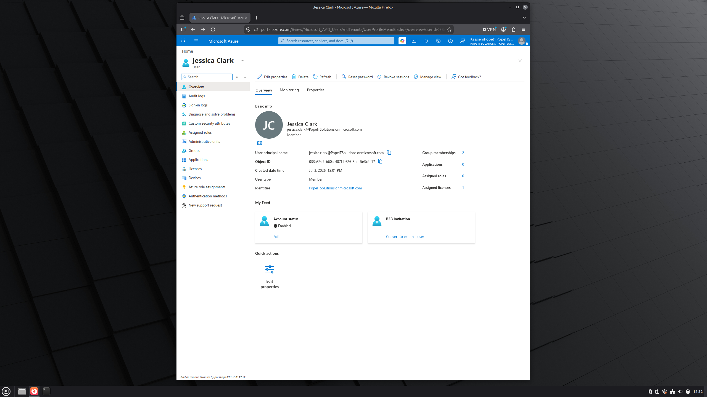
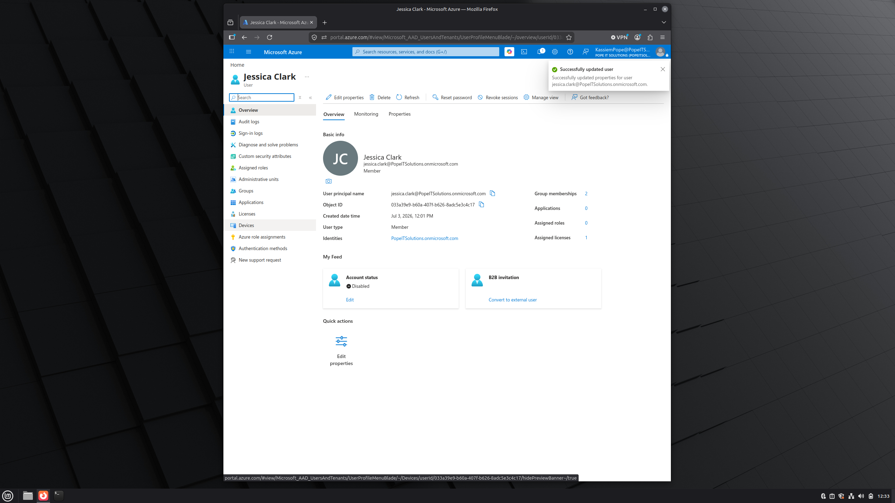
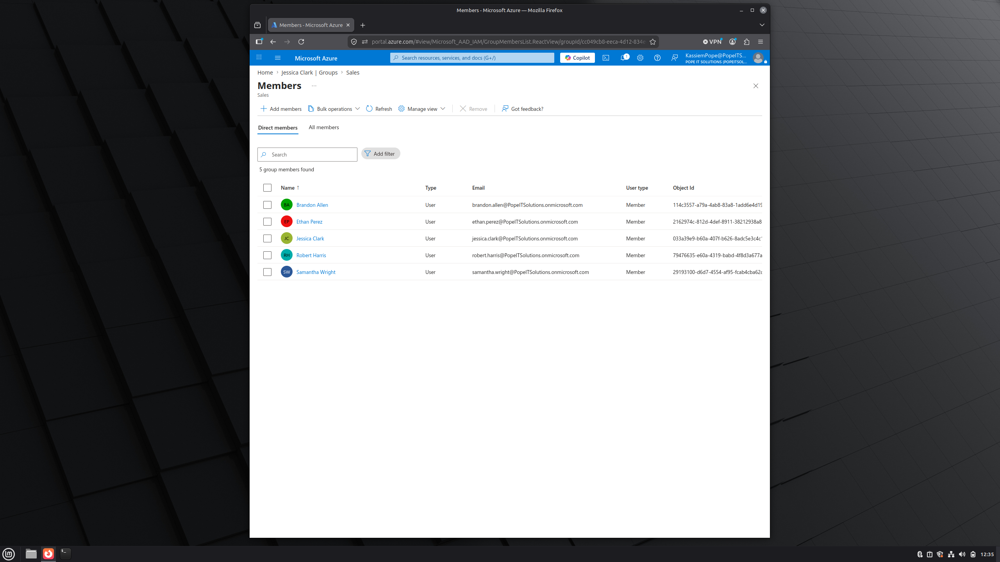
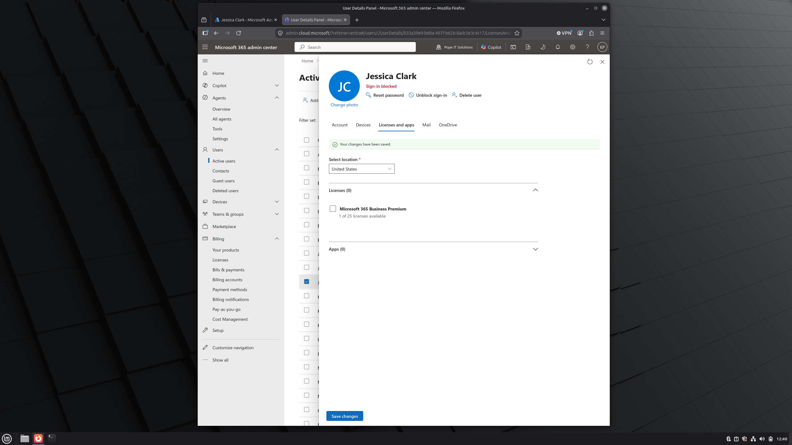

 # Microsoft Entra ID - Employee Offboarding Lab

 ## Overview

 This lab demonstrates a standard employee offboarding process using Microsoft Entra ID and Microsoft 365 Admin Center.

 The objective was to secure a departing employee's account by disabling access, removing permissions,and reclaiming Microsoft 365 licesing.

 ---

 ## Environment

 - Microsoft Entra ID
 - Microsoft 365 Admin Center
 - Pope IT Solutions (Lab Tenant)

---

## Scenario

Human Resources notified IT that employee Jessica Clark had separated from the company.

IT was responsible for securing the account immediately while preserving the account for auditing purposes.

---

## Tasks Performed

- Verified user account informatiom
- Reviewed employee properties
- Disabled the user account
- Blocked user sign-in
- Reviewed security group memberships
- Removed user from department security group
- Verified administrative roles
- Removed Microsoft 365 license
- Documented ticket resolution

---

## Screenshots

### Before Offboarding

### Account Disabled

### Group Membership Review

### License Removed

## Ticket Summary

**Ticket:** OFF-1001

### Issue

HR requested the immediate offboarding of Jessica Clark following employment termination.

### Resolution

- User account disabled
- Sign-in blocked
- Security group membership removed
- Admimistrative roles verified
- Microsoft 365 license reclaimed
- Account secured for auditing

Status: **Resolved**

---

## Skills Demonstrated

- Microsoft Entra ID Administration
- Microsoft 365 Administration
- Identity and Access Management (IAM)
- User Lifecycle Managment
- User Offboarding
- Security Group Management
- Microsoft 365 License Administration
- IT Documentation

---

## Key Takeaways

This lab demonstrates the standard offboarding process performed by IT administrators to protect organizational resourses by revoking user access, reclaiming licenses, and documenting administrative actions according to security best practices.
 
